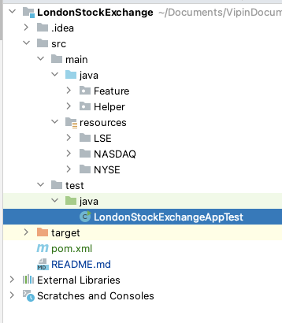
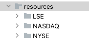

# LondonStockExchange
Identify outliers of timeseries data (Stock price)

The Project is created as part of test "Tech challenge" to find the outliner on given CSV 

Framework is simple to import and run for Execution 

Github link : https://github.com/vipinSagar/LondonStockExchange.git

#Dependencies Used: 
opencsv 5.7.1

**Framework Design** 

Framework is design to handle future modification and by using SOLID principle packages and classes are designed 

framework containing below packages

**Java** >> **Feature** package contain 2 features class "FileReadingFeature" and "OutliersHandlingFeature"

**Java >> Feature >> FileReadingFeature.class :**

**FileReadingFeature** : ReadConsecutiveData(int NoOfConsecutiveData)

**ReadConsecutiveData**  Method is based on 1st Function this will return consecutive data points based on input **NoOfConsecutiveData**

**Java >> Feature >> OutliersHandlingFeature.class :**

**OutliersHandlingFeature :** GetListOfOutlier(List<String[]> inputData)

**GetListOfOutlier**  Method is 2nd function that gets the output from 1st one as a feed and returns the list of outliers

**Java >> Helper >> CSVFileHandler.class :**

**CSVFileHandler** is the class help to **READ** and **WRITE** the Data in CSV files 

**resources :**
resource contain input CSV files 

**test >> java >> LondonStockExchangeAppTest.class**

the method generateTheOutliersDetailsOutPutFile(source,destination,NoOfConsecutiveData) is use source , destination and NoOfConsecutiveData as parameter 